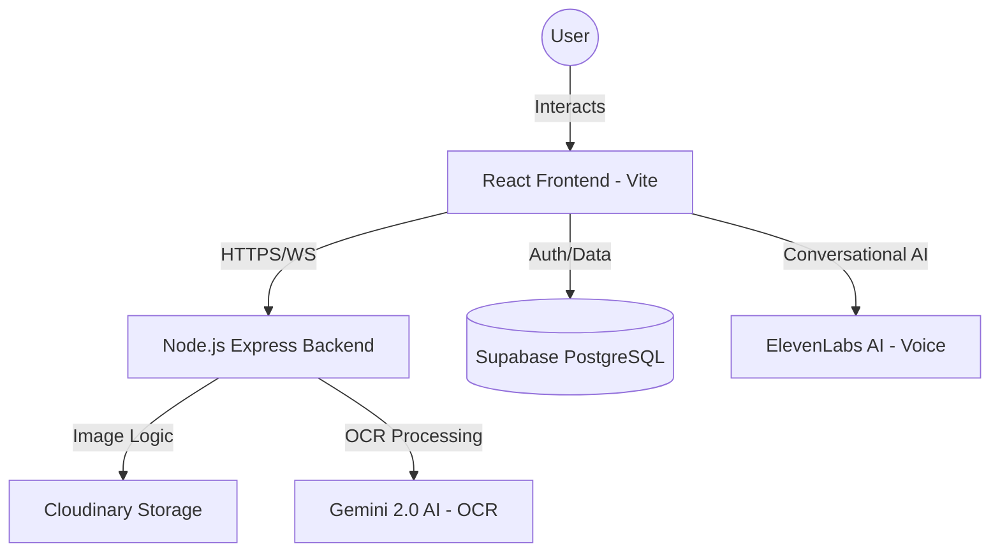

<div align="center">
  
  <h1>FINDO</h1>
  <p><strong>Smart Financial Decisions Powered by AI</strong></p>
  
  <p>
    
    
    
    
  </p>
</div>

---

## 🚀 Overview

Findo is a modern, world-class personal finance manager designed to help you track every expense, monitor financial health, and receive intelligent suggestions tailored to your lifestyle. By combining advanced AI with sleek glassmorphism design, Findo turns complex money management into a simple, intuitive experience.

## 🏗️ Architecture

Findo follows a robust full-stack architecture designed for performance, security, and scalability.



### Stack Breakdown
- **Frontend:** Built with **React 19** and **Vite**, styled with **Tailwind CSS v4** and **Framer Motion** for a high-fidelity glassmorphism UI.
- **Backend:** **Node.js/Express** handles image processing, Cloudinary interactions, and AI orchestrations.
- **Database & Auth:** **Supabase** provides a secure PostgreSQL database with Row-Level Security (RLS) and OAuth/OTP authentication.
- **AI Engine:** 
  - **Gemini 2.0 Flash:** High-speed structured data extraction from physical receipts.
  - **ElevenLabs:** Real-time conversational voice assistant for hands-free tracking.
- **Media Storage:** **Cloudinary** for secure, high-performance image hosting and automatic optimization.

## ✨ Key Features

- **AI Receipt Scanning:** Snap a photo and let Gemini 2.0 extract merchant, items, and totals automatically.
- **Dedicated AI Assistant:** A full-screen chat experience with Finly, your financial co-pilot.
- **Real-Time Analytics:** Dynamic charts and spending trends updated via Supabase listeners.
- **Premium UI:** Smooth transitions, neon gradients, and deep dark-mode support.
- **Security First:** Row-level security for all financial data and secure environment management.

## 🛠️ Setup & Installation

### Prerequisites
- Node.js (v18+)
- Supabase Account
- Cloudinary Account
- Google Gemini API Key
- ElevenLabs API Key

### Installation

1. **Clone the Repo**
   ```bash
   git clone https://github.com/yourusername/findo.git
   cd findo
   ```

2. **Backend Setup**
   ```bash
   cd backend
   npm install
   cp .env.example .env
   # Fill in your CLOUDINARY and SUPABASE keys
   npm run dev
   ```

3. **Frontend Setup**
   ```bash
   cd ../frontend
   npm install
   cp .env.example .env
   # Fill in your VITE_ keys
   npm run dev
   ```

## 🛡️ Security Note

Environment variables are managed via `.env` files. Ensure that your keys are never committed to version control. The `.gitignore` in this project is pre-configured to exclude all `.env` files.

---

<div align="center">
  <p>Findo — Master Your Money</p>
</div>
